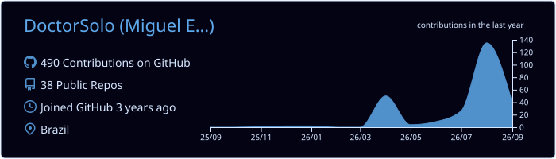
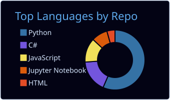

	<!----------------------------------------------------------------------------------------------------------------------------------
	--------------------------------------------------------  TITLE  -------------------------------------------------------------------
	------------------------------------------------------------------------------------------------------------------------------------>
	<h1 align=center> 🤖 - Hello, my name is Miguel, also known as Dr. Solo lol
		<picture>
		  <source height="25" width="25" media="(prefers-color-scheme: dark)" srcset="https://user-images.githubusercontent.com/25423296/163456776-7f95b81a-f1ed-45f7-b7ab-8fa810d529fa.png">
		  <source height="25" width="25" media="(prefers-color-scheme: light)" srcset="https://user-images.githubusercontent.com/25423296/163456779-a8556205-d0a5-45e2-ac17-42d089e3c3f8.png">
		  
		</picture>
	</h1>

	<!----------------------------------------------------------------------------------------------------------------------------------
	------------------------------------------------------  BACKGROUND  ----------------------------------------------------------------
	------------------------------------------------------------------------------------------------------------------------------------>
	

 

	<!----------------------------------------------------------------------------------------------------------------------------------
	------------------------------------------------------  DESCRIPTION  ---------------------------------------------------------------
	------------------------------------------------------------------------------------------------------------------------------------>
	<h2>
		Hello, traveler! Who I'm you ask?
	</h2>
	

		Well, I'm Miguel—a Computer Engineer and Full Stack Developer! Can you believe that? And I'm passionate about building scalable web applications, robust APIs, and modern user interfaces.
	

    

		With a solid background in Computer Engineering, I combine low-level problem-solving with high-level software development. My technical skill set includes:
	

	

    • Backend: C# / ASP.NET Core, Python
    • Frontend: JavaScript / TypeScript, React.js, HTML5, CSS3/Tailwind
    • Environment & Tools: Linux/Bash, Git/GitHub, RESTful APIs
	

	

    I thrive in dynamic environments, constantly seeking to learn new technologies and write clean, maintainable code. Whether architecting backend services or creating intuitive frontend experiences, I am always motivated to tackle complex challenges.
	

	

    Let's connect! I am open to opportunities in Full Stack software engineering. Be sure to check out my
	

	<h2>
	<a target="_blank" href="https://miguel-eduardo.vercel.app/">
		portfolio!
	</a>
	</h2>

<!---------------------------------------------------------------------------------------------------------------------------------->

  

	<!----------------------------------------------------------------------------------------------------------------------------------
	-------------------------------------------------  DATA ABOULT MY ACCOUNT  ---------------------------------------------------------
	------------------------------------------------------------------------------------------------------------------------------------>
	<h3>
		🤖 - Some data about me
	</h3>
	

	
	

<!---------------------------------------------------------------------------------------------------------------------------------->

  

	<!----------------------------------------------------------------------------------------------------------------------------------
	----------------------------------------------------  SOME SOFTWARE I USE  ---------------------------------------------------------
	------------------------------------------------------------------------------------------------------------------------------------>
	<h3 align=center>
		🤖 - Some software I use
	</h3>
	

	<!-- TOOLS -->
	
	
	
	<!-- FRAMEWORK -->
	
	
	
	
	<!-- LANGUAGE -->
	
	
	
	
	
	
	
	
	
	<!-- DATA BASE -->
	
	
	
	
	
	<!-- CLOUD -->
	
	
	<!-- OTHERS -->
	
	
	
	
	

<!---------------------------------------------------------------------------------------------------------------------------------->

  

	<!----------------------------------------------------------------------------------------------------------------------------------
	---------------------------------------------------  MY SOCIAL NETWORKING  ---------------------------------------------------------
	------------------------------------------------------------------------------------------------------------------------------------>
	<h3 align=center>
		🤖 - Follow me too
	</h3>
	

	
	
	
	

<!---------------------------------------------------------------------------------------------------------------------------------->

  

	<!----------------------------------------------------------------------------------------------------------------------------------
	------------------------------------------------------  EASTER EGG  ----------------------------------------------------------------
	------------------------------------------------------------------------------------------------------------------------------------>
	

	<h2 align=center>
		

			🐾🐾 CaaaaaaaaaaaaaaaaaaaaaaaaaaaaaaaaaaaaaaaaaaaaaaaaaaaaaaAT 🐾🐾
		

		
		
		
		
		
		
		
		
		
		
		
		
	</h2>

